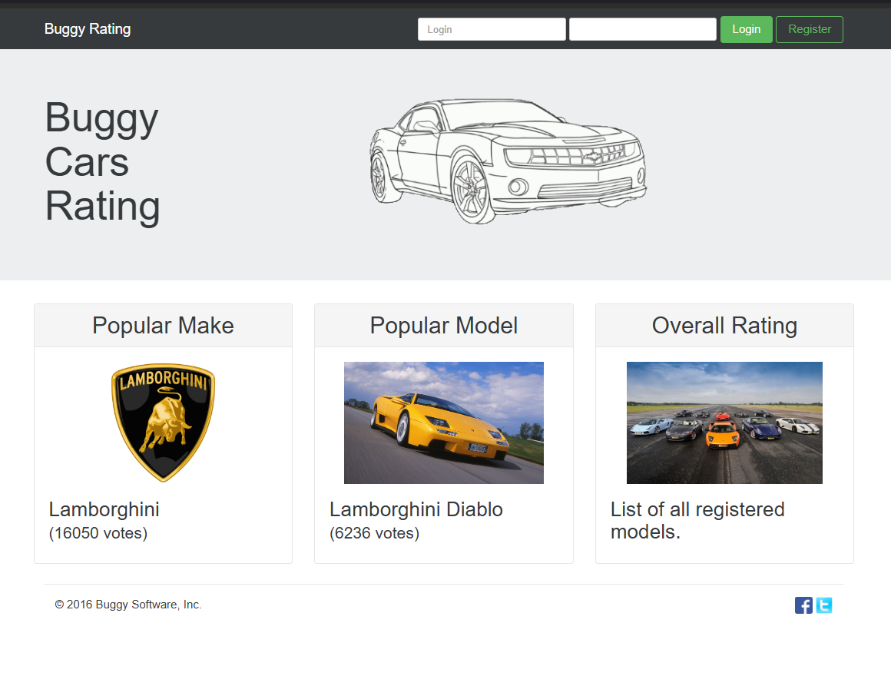
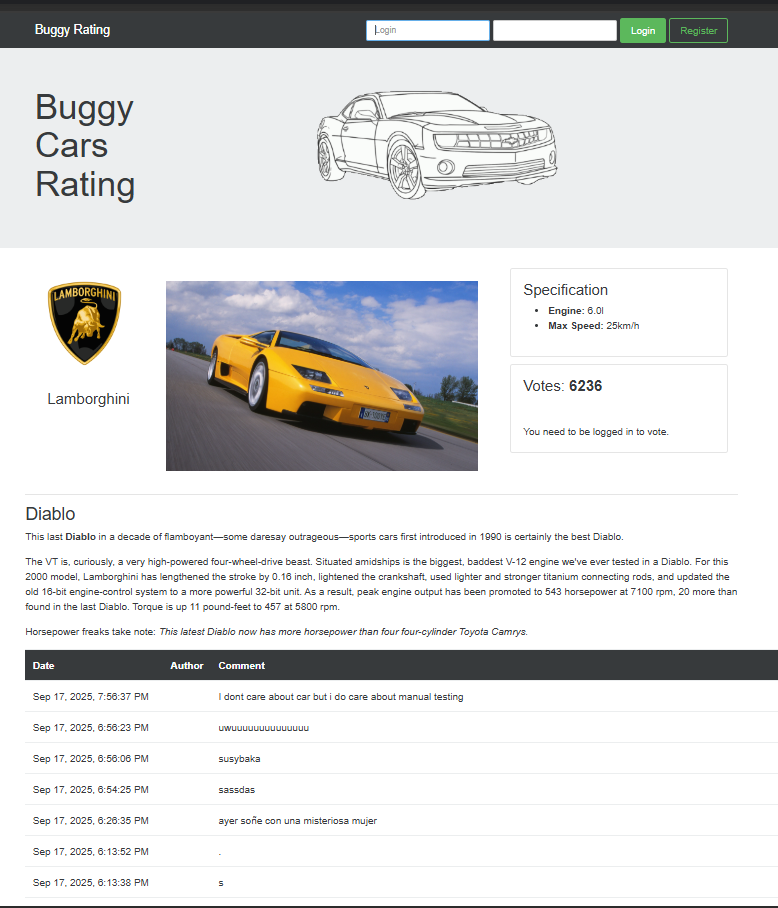
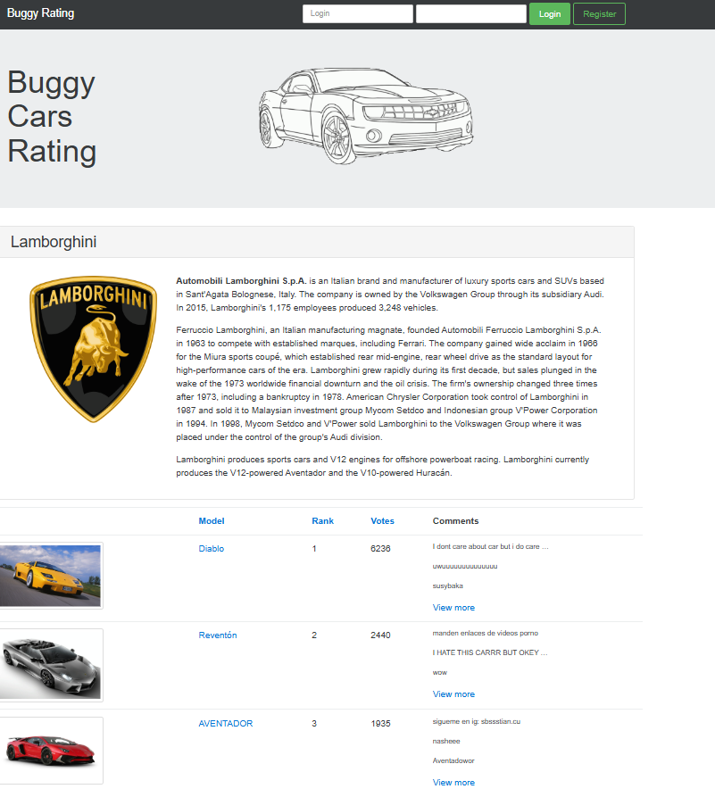
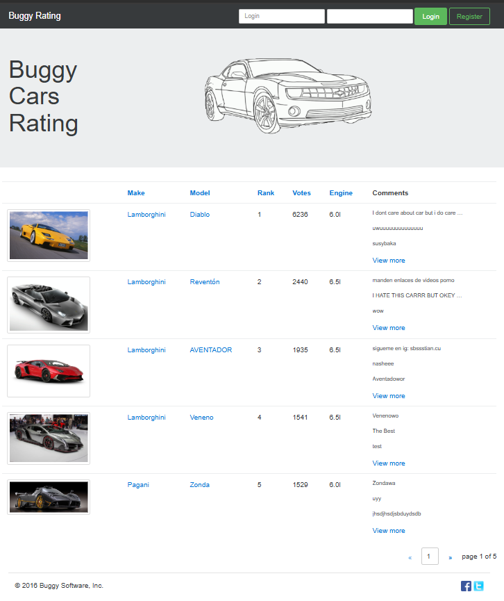

### Manual test:Buggy Cars Rating

## Introduction

The Buggy Car Rating system is a web application where users can rate cars, share feedback, and view ratings given by others. It provides a platform for car enthusiasts to express opinions and for admins to manage the content.

## Objectives

1.To rate cars and leave comments.

2.To see average ratings and feedback from other users.

## Purpose of Manual Testing:
The purpose of manual testing is to verify that the application works as expected by executing test cases without automation tools. It helps identify defects in functionality, usability, and design from a real user’s perspective before release.

## UI of Buggy cars rating
#### 1.

#### 2. 

#### 3. 

###4.

